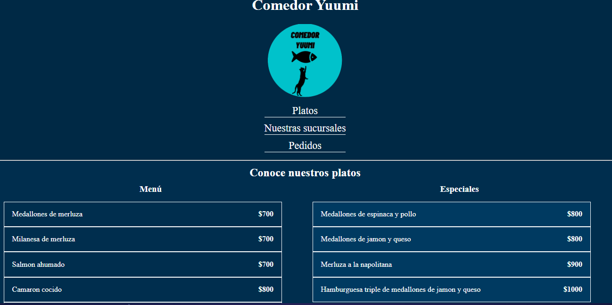

# Comedor Yuummi | Practica HTML-CSS

En esta práctica hay que crear una landing page de un comercio inventado por nosotros aplicando todos los conocimientos adquiridos en las clases de HTML-CSS.

## Tecnologias utilizadas

  

Se utilizo CSS Flexbox y grid para la maquetación de este proyecto.

## Preview

  

### **Puedes ver la Demostración del proyecto [Aqui](https://comedoryuumihtmlcss.netlify.app/).**