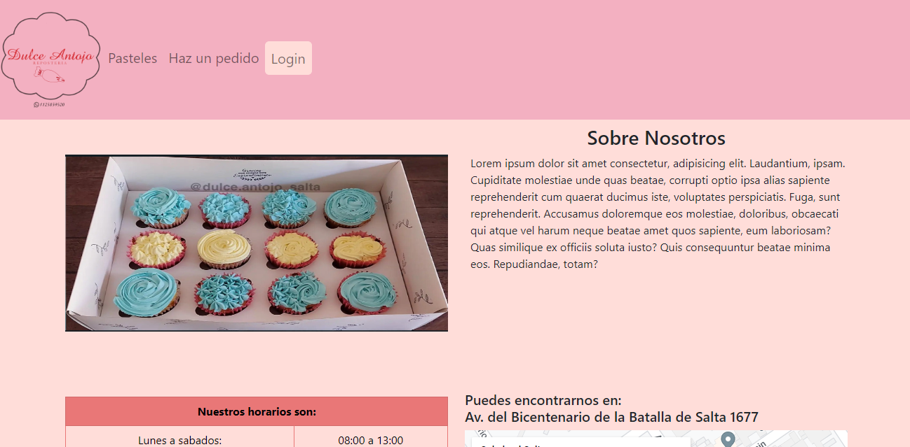
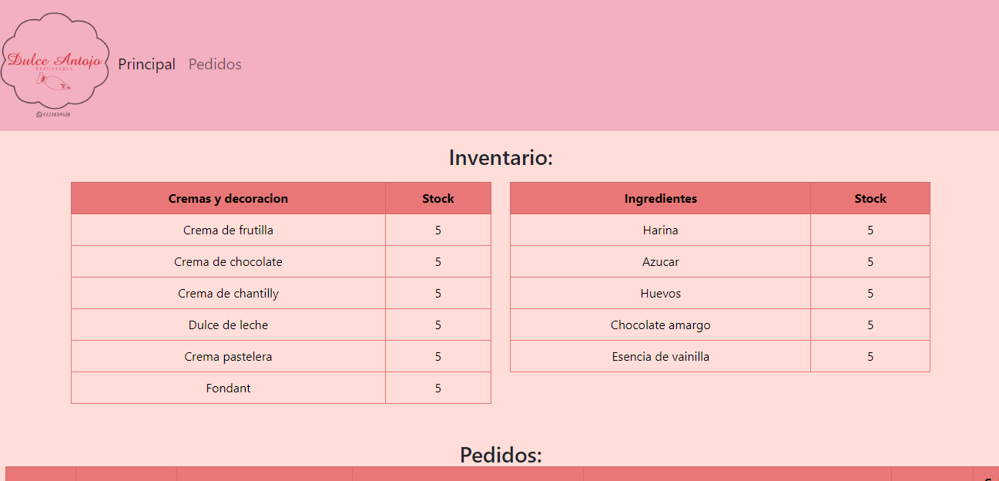

# Dulce Antojo Repostería | Practica #2 HTML-CSS

## Requisitos de la práctica
Descripción:

- El cliente de la pastelería necesita ver los diferentes sabores de pasteles, así como los precios de cada uno.
- El cliente de la pastelería necesita ver los diferentes adornos con los que se puede decorar el pastel y los precios de cada uno.
- El cliente de la pastelería tendrá la posibilidad de combinar sabores dependiendo de sus preferencias.
- El cliente de la pastelería tendrá la posibilidad de combinar adornos dependiendo de sus preferencias.
- El cliente de la pastelería necesita poner en un formulario su pedido.
- El formulario debe de contener los datos de contacto del cliente que son Nombre, Teléfono, Correo Electrónico, Descripción general del pastel y la selección de sabores y adornos.
- El pastelero necesita tener la información de la cantidad de sabores que le quedan para hacer los pasteles.
- El pastelero necesita tener la información de la cantidad de adornos que le quedan para hacer los pasteles.
- El pastelero necesita una tabla donde aparezcan los pedidos que se han realizado con los datos del formulario.
- La página debe tener información de la pastelería que es Dirección, Teléfono y horarios de atención.

### Prácticas a Realizar

Prácticas:
- Crear marca de la pastelería como un logo y los mensajes que daremos desde la marca.
- Maquetación de páginas de cliente de la pastelería.
- Maquetación de páginas del pastelero.

Bonus:
En caso de que te quede corto el ejercicio siguele con esto!
- Bonus de estilos (Intro a CSS)
- Bonus de Rutas (Navegación en la página)
- Bonus de despliegue (Montar la página en línea con dominio gratuito)

## Tecnologías Utilizadas

  

## Funcionamiento
### Parte principal

  

La parte principal tiene una introducción al local y sus datos, una sección con los tipos de pasteles con su precio, los rellenos y decoraciónes que uno puede elegir y al finalizar hay una simulación de formulario para el pedido de un pastel. Tambien tiene en la navbar un login que con el usuario y contraseña: admin-admin podrá acceder a la vista del administrador.

### Parte admin

  

El administrador tendra simulaciones de tablas con el control del stock de su inventario y de pedidos de los clientes.

### **Puedes ver la Demostración del proyecto [Aqui](https://dulceantojopracticabootstrap.netlify.app).**

**user: admin**

**password: admin**