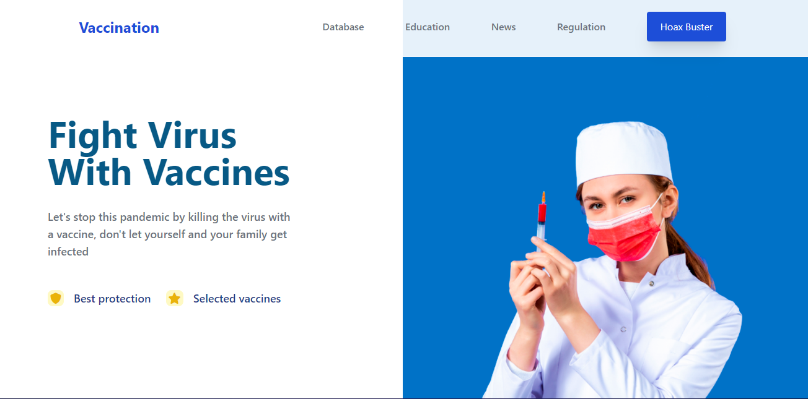

# Clon de Vaccination | Practica CSS

Para está práctica teniamos que intentar clonar lo mejor posible este [diseño](./landingVacunaci%C3%B3n.png) by [Adhiari Subekti](https://dribbble.com/Adhiari_is).

- Planeación de campaña de vacunación (Un poco de mercadotecnia para llegar al sitio)
- Maquetación del sitio con HTML
- Estilos con CSS (Lo más acercado posible, pueden ser otras imágenes, íconos o colores, pero tiene que ser lo más cercano que puedas)

Bonus:
- Bonus de diseños o páginas adicionales (Totalmente a tu creatividad)
- Bonus de despliegue de la página.

## Tecnologías Utilizadas

  

## Preview

  

### **Puedes ver la Demostración del proyecto [Aqui](https://clonvaccinationcss.netlify.app).**
